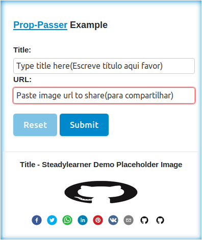

<!-- don't pass this line => lllllllllllllllllllllllllllllllllllllllllllllll -->

<!-- []() -->

[](https://badge.fury.io/js/react-easy-md) []()

# Prop-Passer - Less is more

Extract and remove duplicate **class** names, **props** and **wrapper components** such as **li**, **div**, **section** etc from React code to write **less React code** and make them **reusable**.(Less is more.)

___


```JavaScript
import React from "react";
import {
  Prop,
  PropPasser,
  Passers,
  //
  P,
  share
  //
  key,
  //
  copy,
  repeat,
  // pass,
  // withKeys,
  // withProps,
} from "prop-passer";
```

___

## Install

- Npm: `npm install --save prop-passer`

- YARN: `yarn add prop-passer`

## Demos

 1. [prop-passer example with Codesandbox](https://codesandbox.io/s/8n3m4wy480)
 2. [CRA example](https://github.com/steadylearner/prop-passer/tree/master/examples/prop-passer-example)

They will be similar to this image.


___

## Version Specific

 1. It is minified to save your time to do the same.
 2. `P` and `share` to help you copy and paste props from existing components.(You can use them instead of manually writing prop objects instead.)
 3. The main image is made by [Steadylearner](https://www.steadylearner.com).
 4. This will be the last major update for prop-passer API.

___

## API

Exports:

  1. **`Prop`** ➡ passes the same prop to every children elements.
  2. **`PropPasser`** ➡ When you want to pass prop and include a parent element also.(Prop and a parent wrapper element)
  3. **`Passers`** ➡ Plural version of PropPasser, It will pass wrapper elements with prop for every child elements.
  (Each child element has parent element with prop)
  4. **`P`** and **`share`** ➡ You can use it like `share(<P title="prop-passer"/>)` instead of manually converting `{title: "prop-passer"}` to pass props for **Prop, ProPasser and Passers**.
  5. **`key`** ➡ alphanumeric string with user given length **n** without large depenedency.
  6. `copy` ➡ copies elements user given **n** times. Use it for layout instead of using database seed for simple layout.
  7. `repeat` ➡ repeats function **n** times.

**`class, className, rewrite`** are reserved words to write CSS easily.

every props you define will be substitued at more specific level. But `class` and `className` will be used with existing ones.

    ex) class="this is class" className="this is className"
    ➡ className="this is class this is className"

class names used with `rewrite` will substitue existing `class` or `className` or other `rewrite` at more specific level.

    ex) class="this is class", rewrite="this is to rewrite className"
        ➡ className="this is to rewrite className"
___

## Main API(Prop, PropPasser, Passers)

### Prop(sharedProp)

```js
// This will be omitted in other examples.
import React from "react";
import {
  Prop,
  PropPasser,
  Passers,
  //
  P,
  share
  //
  key,
  //
  copy,
  repeat,
  // pass,
  // withKeys,
  // withProps,
} from "prop-passer";

const ImageProp = Prop(share(<P
  src="www.steadylearner.com/static/images/code/prop-passer.png"
  class="you can use class or className"
  alt="this will be shown"
/>));

// or with manually converting JSX prop to object

// const ImageProp = Prop({
//   src: "www.steadylearner.com/static/images/code/prop-passer.png"
//   class: "you can use class or className",
//   alt: "this will be shown",
// });

  return (
    <ImageProp>
      
      
      
      
    </ImageProp>
  )

  // equals to

  
  
  
  
```

When you use `share(<P />)` instead of manually writing object, You use external 70 bytes with React API.

Normally, You won't need to care for it because prop-passer reduce byte size in the end result by removing duplicate props.

___

### PropPasser(sharedProp)(parentProp)(parentElement)

```js
const ImagePropPasser = PropPasser(share(<P
  src="www.steadylearner.com/static/images/code/prop-passer.png"
  class="you can use class or className"
  alt="this will be shown"
/>))(class: "for section")("section");

  return (
    <ImagePropPasser>
      
      
      
    <ImagePropPasser>
  )

  // equals to code snippet below

  <section class="for section">
    
    
    
  </section>
```

It is just **Prop** and parent element for children elements.
___

### Passers(sharedProp)(parentProp)(parentElement)

```js
const ImagePassers = Passers(share(<P
  src="www.steadylearner.com/static/images/code/prop-passer.png"
  class="you can use class or className"
  alt="this will be shown"
  onClick={function(){
    console.log("You can pass the same functions to each child elements also.")
  }}
/>))(class: "for list")("li");

  return (
    <ImagePassers>
      
      
      
      
    <ImagePassers>
  )

  // equals to pass wrapper <li></li> manually
  // (No need to define key manually.)

  <li
    class="for list"
    key="p-xxxxx"
    style={{listStyle: "none"}}
  >
    
  </li>
  <li
    class="for list"
    key="p-xxxxx"
    style={{listStyle: "none"}}
  >
    
  </li>
  <li
    class="for list"
    key="p-xxxxx"
    style={{listStyle: "none"}}
  >
    
  </li>
  <li
    class="for list"
    key="p-xxxxx"
    style={{listStyle: "none"}}
  >
    
  </li>
```

It is just a plular version of **PropPasser**.
You don't have to manually copy and paste wrapper elements and its props.
___

### Key(times)

`key(10)` ➡ xxxxxxxxxx

```JavaScript
import { key } from "prop-passer";

console.log(key(10)); // xxxxxxxxxx
```

You can make your own alphanumeirc numbers with `key(n)`.
(We don't need large dependency for that.)
___

## Development API(Copy, Repeat)

### Copy(element)(times)

```JavaScript
import "React" from "react";

const image = ;
copy(image)(1000); //  * 1000
```

Test it with string and images in your local machine.
___

### Repeat(function)(times)

```JavaScript
import { repeat } from "prop-passer";

repeat(function(){ console.log("repeat api from prop-passer, show it n times")})(1000);

// "repeat api from prop-passer, show it n times" * 1000
```

It show the message n times. Test in your local machine.
___

## Experimental API(pass, withKeys, withProps)

### pass

```JavaScript
import React from "react";
import {
  pass,
} from "prop-passer";

let withPass = pass("li")({
  // 1. Write object with props for <li> element or use share(<P />) syntax for multiple props.
  // 2. You can pass anything you want
  // 3. key() shouldn't be included here for it will be the same for every children components
})([
  <p>prop-passer</p>,
  <h1>prop-passer</h1>,
  <h6>prop-passer</h6>,
  <p>prop-passer</p>,
]);

return(
  <section>
    <ul>{withPass}</ul>
  </section>
)

// will generate code below

<section>
  <ul>
    <li style={ { listStyle: "none" } } key="p-xxxxx" >
      <p>prop-passer</p>
    </li>
    <li style={ { listStyle: "none" } } key="p-xxxxx" >
      <h1>prop-passer</h1>
    </li>
    <li style={ { listStyle: "none" } } key="p-xxxxx" >
      <h6>prop-passer</h6>
    </li>
    <li style={ { listStyle: "none" } } key="p-xxxxx" >
      <p>prop-passer</p>
    </li>
  </ul>
</section>
```

This is just the reverse API of **Passers**.
___

### withKeys or withProps

They are to pass props to every children elements.
For React protects those property names, you wouldn't need them.
Test them if you want to understand what prop-passer API does with plain objects.

## Read

1. [steadylearner Blog Page](www.steadylearner.com/blog/search/prop-passer)

2. [steadylearner Medium Post](https://medium.com/@steadylearner/)

3. [React Children API blog post](https://mxstbr.blog/2017/02/react-children-deepdive/)

## What is the next?

1. Test
2. Post

## Copy and Paste with share and P API or manually write object?

You can use object when there are few props.
But you can use `share(<P title="prop-passser">)` syntax.
So that you can just copy and paste prop parts inside the valid scope.

You can test them at **CodeSandbox**.

1. [First manual test with sizeof](https://codesandbox.io/s/jn47p3v4ny)

2. [Test with Rust Chat App layout](https://codesandbox.io/s/u59hx)

## Summary

The main point of this package is to help you work less.

1. Extract common parts from your React app after you complete it.(Less code size.)

2. Define common props and wrapper components first and write React Code.(Prototype Properties and wrappers)
