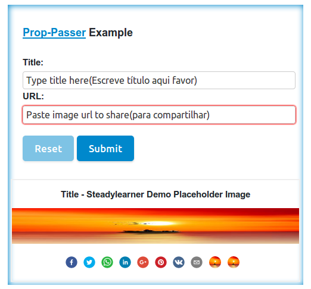

<!-- don't pass this line => lllllllllllllllllllllllllllllllllllllllllllllll -->

<!-- []() -->

[](https://badge.fury.io/js/react-easy-md) []()

# Prop-Passer - Extract Common Props from React

 You can remove common class and other props that take up space in your file with it.
 ___

 

```JavaScript
import React, { Component } from "react";
import {
  copy,
  repeat,
  key,
  pass,
  Prop,
  PropPasser,
  Passers,
} from "prop-passer";

let withPass = pass("li")({
  // 1. write object with props for parent <li> element
  // 2. You can pass anything you want
  // 3. but key() shouldn't be included here for it will be the same for
  // every elemenet
})([
  <p>placeholder</p>,
  <h1>placeholder</h1>,
  <h6>placeholder</h6>,
  <p>placeholder</p>,
  // <p key="if you want custom ones, write it manually for every components">placeholder</p>
  // * { key: "p-xxxxx", list-style: "none" } is default for <li>
]);

return(
  <section>
    <ul>{withPass}</ul>
  </section>
)

// will generate code below

<section>
  <ul>
    <li style={ { listStyle: "none" } } key="p-xxxxx" >
      <p>placeholder</p>
    </li>
    <li style={ { listStyle: "none" } } key="p-xxxxx" >
      <h1>placeholder</h1>
    </li>
    <li style={ { listStyle: "none" } } key="p-xxxxx" >
      <h6>placeholder</h6>
    </li>
    <li style={ { listStyle: "none" } } key="p-xxxxx" >
      <p>placeholder</p>
    </li>
  </ul>
</section>

```

___

## Install

- Npm: `npm install --save prop-passer`

- YARN: `yarn add prop-passer`

## Demos

 1. [prop-passer example with Codesandbox](https://codesandbox.io/s/8n3m4wy480)
 2. [CRA example](https://github.com/steadylearner/prop-passer/tree/master/examples/prop-passer-example)


___

## Version Specific

 1. Organize internal API and comments.
 2. CRA example and rewrite README.md file.

___

## API

Exports:

  1. `copy` ➡ copies elements **n(<= 1000)** times and use it for placeholders.
  2. `pass` ➡ similar to Passers(Reverse Process and diffrenet API)
  3. `repeat` ➡ repeats function **n(<= 1000)** times.
  4. **`Prop`** ➡ passes shared prop to children elements.
  5. `PropPasser` ➡ When you want to include parent element with Prop and modify wrapper components easily
  6. **`Passers`** ➡ extract common props and wrapper elements such as `li`, plural version of PropPasser
  7. **`key`** ➡ alphanumeric string with user given length n without large depenedency
  8. **`class, className, rewrite`** - reserved words to write CSS easily

  ➡ every prop you define will be replaced at more specific level.
  ➡ But `class` and `className` will be placed together with existing ones.

    ex) class="this is class" className="this is className"
        ➡ className="this is class this is className"

  ➡ `rewrite` will replace existing `class` or `className` or other `rewrite`

    ex) class="this is class", rewrite="this is to rewrite className"
        ➡ className="this is to rewrite className"
___

## Usages(Prop, PropPasser, Passers, copy)

### Prop(sharedProp)

```js

const ImageProp = Prop({
  src: "https://www.placeholder.com/demo-img"
  class: "you can use class or className",
  alt: "this will be shown",
  onClick: repeat(function(){
    console.log("This will be shown 150 times when you click this")
  })(150)
});

  return (
    <ImageProp>
      
      
      
      
    </ImageProp>
  )

  // equal to

  
  
  
  

```

### PropPasser(sharedProp)(parentProp)(parentElement)

```js
const ImagePropPasser = PropPasser({
  src: "https://www.placeholder.com/demo-img"
  class: "you can use class or className",
  alt: "this will be shown",
  onClick: function(){
    console.log("You can pass functions to each child element.")
  }
})(class: "for section")("section");

  return (
    <ImagePropPasser>
      
      
      
    <ImagePropPasser>
  )

  // equals to code snippet below, It is just Prop and parent element

  <section class="for section">
    
    
    
  </section>
```

### Passers(sharedProp)(parentProp)(parentElement)

```js
const ImagePassers = Passers({
  src: "https://www.placeholder.com/demo-img"
  class: "you can use class or className",
  alt: "this will be shown",
  onClick: function(){
    console.log("You can pass functions to each child elements.")
  }
})(class: "for list")("li");

  return (
    <ImagePassers>
      
      
      
      
    <ImagePassers>
  )

  // equals to and no wrapper li elements and need to define key prop manually

  <li class="for list" key="p-xxxxx" style={{listStyle: "none"}}>
    
  </li>
  <li class="for list" key="p-xxxxx" style={{listStyle: "none"}}>
    
  </li>
  <li class="for list" key="p-xxxxx" style={{listStyle: "none"}}>
    
  </li>
  <li class="for list" key="p-xxxxx" style={{listStyle: "none"}}>
    
  </li>

```

### Copy(element)(times)

```JavaScript
  const image = ;
  let manyImages = copy(image)(1000);

  return (
    <section>
      {manyImages}
    </section>
  )

  // equals to, you can use it instead of placeholders or seed

  <section>
     * 1000
  </section>

```

___


### Key(times)

You can make your own alphanumeirc numbers with `key(n)`

`key(10)` ➡ xxxxxxxxxx

___


## Read

 - [steadylearner Blog Page](www.steadylearner.com/blog)
 - [steadylearner Medium Post](https://medium.com/@steadylearner/)
 - [React Children API blog post](https://mxstbr.blog/2017/02/react-children-deepdive/)

## What is the next?

  1. Tests
  2. Blog posts to explain API at [Steadylearner](www.steadylearner.com/blog)
